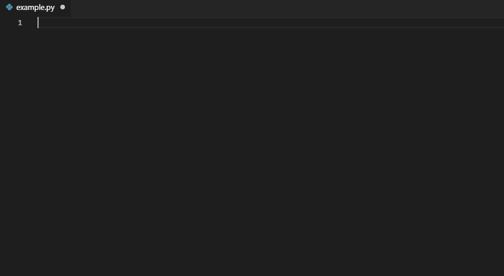

=========================================================
A Policy Gradient Approach for Tactical Asset Allocation
=========================================================

.. image:: https://img.shields.io/travis/SvenBecker/pgtaa.svg
        :target: https://travis-ci.org/SvenBecker/pgtaa
        :alt: Travis build status

.. image:: https://readthedocs.org/projects/pgtaa/badge/?version=latest
        :target: https://pgtaa.readthedocs.io/en/latest/?badge=latest
        :alt: Documentation Status        

.. image:: https://img.shields.io/badge/licence-MIT-red.svg   
        :target: https://github.com/SvenBecker/pgtaa/blob/master/LICENSE
        :alt: Licence

.. image:: https://img.shields.io/badge/version-v0.1.0-blue.svg
        :target: https://github.com/SvenBecker/pgtaa/releases
        :alt: GitHub release

This projects aims to provide a Reinforcement-Learning (RL) approach to the Tactical Asset Allocation (TAA) problem.
Given a financial portfolio of multiple assets, the optimal and dynamic allocation of the assets is a common problem in active portfoilo management.
TAA involves the identification of market inefficiencies to exploit market timing effects by short term reallocation of the asset weights. 

.. contents:: Table of Contents
        :depth: 2

Introduction
-------------

Configurations
--------------

To change the configurations of the environment you can either change them directly using the
`config.json <pgtaa/config.json>`_ file
or run the `config.py <pgtaa/config.py>`_ file using the flags listed below. By calling the
`config.py <pgtaa/config.py>`_ file a new config file `mod_config.json` will be created. If you want to go back to
the default setting just delete that config file.
Changes to the data basis can also been made through the `config.json` file but it is not recommend.
Otherwise you have to train the supportive prediction models again.

Data
----

Data can be requested using `pandas_datareader <https://pandas-datareader.readthedocs.io/en/latest/>`_.
So far this project supports `Yahoo Finance <https://finance.yahoo.com/>`_,
`Federal Reserve of Economic Data (FRED) <https://www.stlouisfed.org/>`_,
`The Investors Exchange <https://iextrading.com/>`_,
`Moscow Exchange <https://www.moex.com/en/>`_ and `Stooq <https://stooq.com/>`_
as data resources. Only the (adjusted if available) closing prices will be tracked.

.. note:: Unfortunately there are often changes in the APIs of those website so I can't guarantee that those sites are still being supported some time onwards. At the time writing those supported websites are indeed working as intended.

.. warning:: Currently TensorFlow only supports Python version <=3.6. 

* Free software: `MIT License <https://github.com/SvenBecker/pgtaa/blob/master/LICENSE>`_
* Documentation: https://pgtaa.readthedocs.io.

Features
--------

* TODO

Contributing
------------

Please take a look at `Contributing <CONTRIBUTING.rst>`_.

Credits
-------

This package was created with Cookiecutter_ and the `audreyr/cookiecutter-pypackage`_ project template.

.. _Cookiecutter: https://github.com/audreyr/cookiecutter
.. _`audreyr/cookiecutter-pypackage`: https://github.com/audreyr/cookiecutter-pypackage
